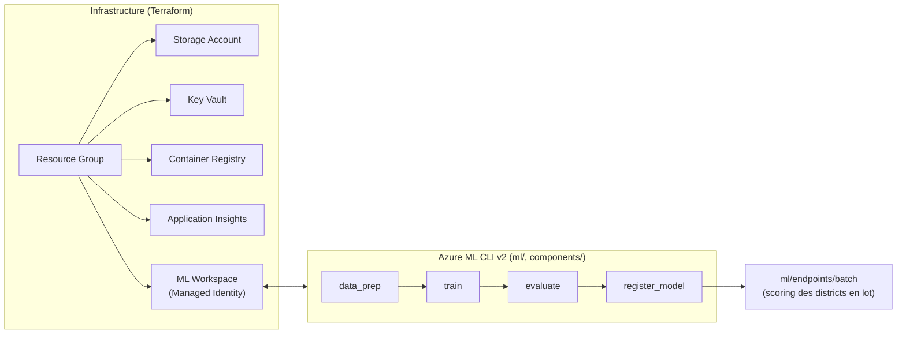

# Azure ML Starter Kit

Starter kit interne SBI : la base que nous clonons pour démarrer un projet
Machine Learning sur Azure chez un client — infrastructure Terraform,
composants et pipeline Azure ML CLI v2/SDK v2, CI/CD dev → prod.
Ce dépôt n'est pas livré au client tel quel : on **clone une copie par
client** et on la personnalise pour son projet — voir
[docs/CUSTOMIZATION_GUIDE.md](docs/CUSTOMIZATION_GUIDE.md).

## Architecture



Détails : [docs/ARCHITECTURE.md](docs/ARCHITECTURE.md) ·
[docs/MLOPS_LIFECYCLE.md](docs/MLOPS_LIFECYCLE.md)

## Structure du dépôt

```
infrastructure/terraform/   Infrastructure Azure (IaC)
environments/                Variables Terraform par environnement (dev/staging/prod)
ml/                           Assets Azure ML CLI v2 : data, compute, environments,
                               pipelines, jobs, model, endpoints
components/                   Composants réutilisables (data_prep, train, evaluate,
                               register_model) — un dossier = une responsabilité
tools/                        Générateur/validateur de composants
tests/                        unit/, integration/, smoke/
sample_data/                  Données d'exemple (SAMPLE — à remplacer)
notebooks/                    Notebook d'exploration (SAMPLE)
docs/                         Documentation détaillée
```

## Prérequis

- [Terraform](https://developer.hashicorp.com/terraform/install) ≥ 1.5
- [Azure CLI](https://learn.microsoft.com/cli/azure/install-azure-cli) +
  extension ML : `az extension add -n ml`
- Python ≥ 3.11
- Un abonnement Azure avec les droits de création de ressources

## Démarrage rapide

```bash
az login
az account set --subscription "<subscription-id>"

# State Terraform distant — une seule fois par client/tenant
make bootstrap-tfstate
# puis créer environments/backend-dev.hcl (voir backend-dev.hcl.example et
# la sortie de bootstrap-tfstate)

# Environnement Python
make install-dev
```

**Raccourci** : une fois le state Terraform bootstrappé ci-dessus, toute la
suite (infra + compute/environnement Azure ML + RBAC + data asset + premier
job) tient en une commande :

```bash
make bootstrap-project ENV=dev
```

Détail de ce qu'elle fait (utile pour comprendre/dépanner, ou pour ne
dérouler que certaines étapes) :

```bash
# Infrastructure
make tf-init ENV=dev
make tf-plan ENV=dev
make tf-apply ENV=dev

# Assets Azure ML — une seule fois par workspace
az ml compute create --file ml/compute/compute-cluster.yml \
  --resource-group <rg> --workspace-name <workspace>
az ml environment create --file ml/environments/training-environment.yml \
  --resource-group <rg> --workspace-name <workspace>

# Uniquement en mode RBAC (ACR sans compte admin, voir
# ml/compute/compute-cluster.yml) : autoriser le compute à pull les images
# Docker. Exige Owner / RBAC Administrator. Inutile avec la configuration
# actuelle de dev et prod (admin_enabled = true), déployable avec le seul
# rôle Contributor sur le resource group.
COMPUTE_PRINCIPAL_ID=$(az ml compute show --name cpu-cluster \
  --resource-group <rg> --workspace-name <workspace> \
  --query identity.principal_id -o tsv)
ACR_ID=$(az acr show --name <acr-name> --resource-group <rg> --query id -o tsv)
az role assignment create --assignee-object-id "$COMPUTE_PRINCIPAL_ID" \
  --assignee-principal-type ServicePrincipal --role AcrPull --scope "$ACR_ID"

# Pipeline d'entraînement d'exemple
az ml data create --file ml/data/sample-data-asset.yml \
  --resource-group <rg> --workspace-name <workspace>
az ml job create --file ml/pipelines/training-pipeline.yml \
  --resource-group <rg> --workspace-name <workspace>
```

Personnalisation projet par projet : suivre
[docs/CUSTOMIZATION_GUIDE.md](docs/CUSTOMIZATION_GUIDE.md) (20 points, avec
fichiers exacts à modifier).

## Workflow ML

```
data_prep → train → evaluate → register_model (conditionnel)
```

Chaque composant est indépendant, testable isolément
(`components/<nom>/tests/`) et documenté (`components/<nom>/README.md`).
Ajouter un composant :
```bash
make new-component NAME=mon_composant
```

## Commandes principales

| Commande | Effet |
|---|---|
| `make help` | Liste toutes les commandes disponibles |
| `make bootstrap-tfstate` | Provisionner le storage account de state Terraform (une fois par client) |
| `make tf-init ENV=dev` | Initialiser Terraform (backend distant) |
| `make tf-plan ENV=dev` / `tf-apply` | Planifier/appliquer l'infrastructure |
| `make test` | Tous les tests (unit, integration, components) |
| `make lint` / `make format` | Qualité de code (ruff) |
| `make new-component NAME=x` | Générer un nouveau composant Azure ML |
| `make validate-yaml` | Valider les schémas Azure ML CLI v2 |
| `make run-local` | Pipeline complet en local, sans Azure |

## Documentation

| Document | Contenu |
|---|---|
| [docs/ARCHITECTURE.md](docs/ARCHITECTURE.md) | Détail de l'infrastructure et des ressources |
| [docs/CUSTOMIZATION_GUIDE.md](docs/CUSTOMIZATION_GUIDE.md) | Ce qui change pour chaque nouveau client |
| [docs/MLOPS_LIFECYCLE.md](docs/MLOPS_LIFECYCLE.md) | Cycle de vie du modèle, CI/CD, tests |
| [docs/SECURITY.md](docs/SECURITY.md) | Identités, RBAC, secrets, réseau |
| [docs/TROUBLESHOOTING.md](docs/TROUBLESHOOTING.md) | Dépannage Terraform / Azure ML |
| [docs/CONTRIBUTING.md](docs/CONTRIBUTING.md) | Workflow Git et convention de commit |

## Licence

MIT — voir [LICENSE](LICENSE).
