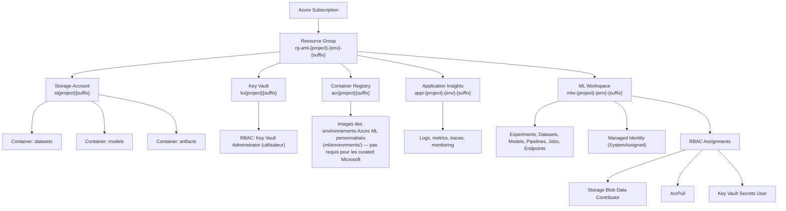

# 🏗️ Architecture

Architecture complète de l'infrastructure Azure ML Platform.

## Vue d'Ensemble



Un second resource group, `rg-tfstate-{project}`, existe en dehors de cette
arborescence : il contient uniquement le storage account du state
Terraform (voir `infrastructure/terraform/README.md`), provisionné hors
Terraform et jamais touché par `scripts/destroy.sh`.

## Flux de Données

```
Data Source
  ↓
Storage Account (datasets container)
  ↓
ML Workspace
  ├→ Training Pipeline
  │   └→ Models Container
  ├→ Inference Pipeline
  │   └→ Endpoints
  └→ Monitoring
      └→ Application Insights
```

## Couche Azure ML CLI v2 (`ml/`, `components/`)

L'infrastructure ci-dessus héberge un pipeline d'entraînement composé de
petits composants réutilisables, chacun avec une responsabilité unique :

```
components/data_prep  →  components/train  →  components/evaluate  →  components/register_model
      (nettoyage,          (entraînement          (métriques sur         (enregistrement
     split train/test)      + log MLflow)          jeu de test)        conditionnel dans le
                                                                         Model Registry)
```

Ce flux est orchestré par `ml/pipelines/training-pipeline.yml` (le YAML ne
contient aucune logique ML — uniquement l'enchaînement des composants).
Détails complets : [MLOPS_LIFECYCLE.md](MLOPS_LIFECYCLE.md).

## Sécurité

- ✅ **Managed Identity** : Pas de secrets en clair
- ✅ **RBAC** : Permissions précises (least privilege)
- ✅ **Key Vault** : Gestion centralisée des secrets
- ✅ **HTTPS + TLS 1.2 minimum** : Connexions sécurisées
- ✅ **Soft Delete + versioning** : Storage Account (datasets/modèles) et
  Key Vault — récupération en cas de suppression/écrasement accidentel

## Ressources Créées

| Ressource | Quantité | Type |
|-----------|----------|------|
| Resource Group | 1 | Conteneur |
| Storage Account | 1 | Stockage (+ 3 conteneurs) |
| Key Vault | 1 | Secrets |
| Container Registry | 1 | Images Docker |
| Application Insights | 1 | Monitoring |
| ML Workspace | 1 | ML |
| RBAC Assignments | 4 | Permissions |
| **Total** | **15** | - |

